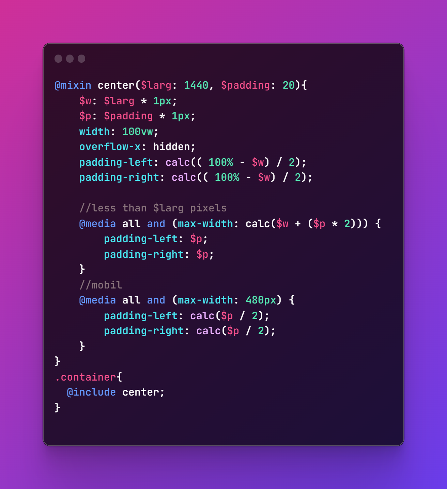

# @mixin

---------

<blockquote class="twitter-tweet">
<a href="https://twitter.com/mixin?ref_src=twsrc%5Etfw">@mixin</a> en SCSS rend votre code plus réutilisable⚙️. Pourtant très peu de personnes s’en servent. THREAD 🔽 <a href="https://t.co/jjnXlat2me">pic.twitter.com/jjnXlat2me</a>
&mdash; Franklin (@franklin_tenepo) <a href="https://twitter.com/franklin_tenepo/status/1617931256527998977?ref_src=twsrc%5Etfw">January 24, 2023</a></blockquote> 